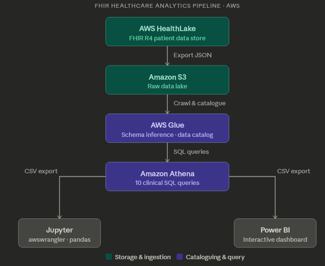

# FHIR Healthcare Analytics Pipeline on AWS

An end-to-end cloud data pipeline that ingests synthetic FHIR (Fast Healthcare Interoperability Resources) data into AWS HealthLake, transforms and catalogues it for SQL-based analysis, and delivers interactive dashboards via Power BI.

Built to demonstrate real-world healthcare data engineering patterns using AWS-native services.

---

## Architecture



---

## Project Structure

```
fhir-aws-pipeline/
├── infra/
│   └── reproduce_pipeline.sh   # Provisions all AWS resources
├── athena_queries/             # SQL queries for table creation and analysis
├── notebooks/                  # Jupyter notebooks and exported CSV files
└── visualizations/             # Prototype charts and final Power BI dashboard
```

---

## Pipeline Overview

### 1. Data Ingestion
Synthetic FHIR R4 patient data is stored in AWS HealthLake and exported to an S3 bucket in JSON format. HealthLake handles FHIR-native validation and storage, making the data immediately queryable downstream.

### 2. Cataloguing with Glue
An AWS Glue Crawler scans the S3 export and automatically infers schema, registering tables in the Glue Data Catalog. This enables Athena to query the FHIR data using standard SQL without manual schema definition.

### 3. SQL Analysis with Athena
Athena queries are written against the catalogued FHIR tables to extract clinically relevant views. All queries are saved under `/athena_queries` and cover areas including:

| Query | Description |
|---|---|
| `Average_LOS_per_Encounter.sql` | Average length of stay by encounter type (AMB / EMER / IMP) |
| `Avg_BloodPressure_Over_Time.sql` | Average systolic blood pressure trend by year |
| `Demographics_by_Gender_Age.sql` | Patient counts by age bracket and gender |
| `Encounter_Volume_by_Day.sql` | Total encounters by day of week across the dataset |
| `High_Utilizer_Cohort.sql` | Patients with the highest number of encounters |
| `MedRequests_by_Drug.sql` | Most frequently requested medications |
| `Patient_Comorbidity_by_Age.sql` | Number of conditions per patient segmented by age group |
| `Repeat_Visits.sql` | Patients with multiple visits — frequency and date range |
| `Top10_Diagnoses.sql` | Most common diagnoses by occurrence count |
| `Top10_Vaccines.sql` | Most frequently administered vaccines |

Example query — encounter volume by day of week:

```sql
SELECT
  day_of_week,
  COUNT(*) AS encounters
FROM (
  SELECT
    date_format(
      cast(from_iso8601_timestamp(period.start) AS timestamp),
      '%W'
    ) AS day_of_week
  FROM fhir_datastore.encounter
  WHERE period.start IS NOT NULL
)
GROUP BY day_of_week
ORDER BY
  CASE day_of_week
    WHEN 'Sunday' THEN 1
    WHEN 'Monday' THEN 2
    WHEN 'Tuesday' THEN 3
    WHEN 'Wednesday' THEN 4
    WHEN 'Thursday' THEN 5
    WHEN 'Friday' THEN 6
    WHEN 'Saturday' THEN 7
    ELSE 8
  END;
```

### 4. Visualisation
Results are pulled into Jupyter Notebooks via `awswrangler` for exploratory analysis and prototype charts using `pandas`. Final visualisations are produced in Power BI, with CSVs exported from Athena as the data source. Notebooks and CSVs live in `/notebooks`; charts and the dashboard in `/visualizations`.

The Power BI dashboard covers:
- Encounter length and frequency by type (AMB / EMER / IMP)
- Encounter volume by day of week (1994–2020)
- Most active patients by observation count and visit history
- Top diagnoses, medications, and vaccines by frequency
- Patient demographics by age and gender
- Average blood pressure trends over time
- Comorbidity burden by age group

---

## Setup & Reproduction

### Prerequisites
- AWS account with IAM permissions for HealthLake, S3, Glue, and Athena
- AWS CLI configured locally (`aws configure`)
- Python 3.8+, with `awswrangler` and `pandas` installed
- Power BI Desktop (for dashboard)

### 1. Deploy Infrastructure

```bash
cd infra
chmod +x reproduce_pipeline.sh
./reproduce_pipeline.sh
```

This script provisions the required AWS resources (S3 bucket, Glue Crawler, Athena workgroup) and triggers the HealthLake export.

### 2. Run Athena Queries

Once the Glue Crawler has completed, open the queries in `/athena_queries` and run them in the Athena console or via `awswrangler` in the notebooks. These create analysis-ready tables from the raw FHIR export.

### 3. Explore in Jupyter

```bash
pip install awswrangler pandas
jupyter notebook notebooks/
```

The notebooks connect to Athena, pull query results, and generate prototype visualisations.

### 4. View the Dashboard

Open the Power BI file in `/visualizations` using Power BI Desktop to view the final interactive dashboard.

---

## Key Skills Demonstrated

- **Cloud data engineering** — end-to-end pipeline design on AWS
- **Healthcare data standards** — working with FHIR R4 data structures
- **SQL** — Athena queries for clinical reporting use cases
- **Python** — data wrangling with pandas and awswrangler
- **BI tooling** — dashboard delivery in Power BI
- **Infrastructure as code** — reproducible environment via shell script

---

## Notes

- All patient data used in this project is **fully synthetic** — no real patient information is involved.
- This project was built as a portfolio piece to demonstrate healthcare data engineering patterns, not for clinical or production use.

---

## Author

Mohamed | [GitHub](https://github.com/mo-mo35) | B.S. Data Science, UC San Diego
