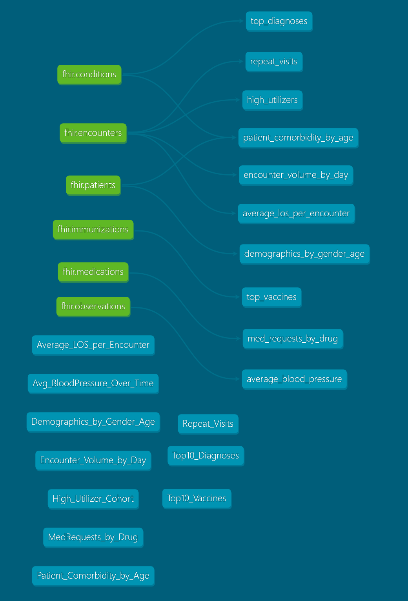

# FHIR Healthcare Analytics Pipeline

An end-to-end healthcare data pipeline that ingests synthetic FHIR R4 patient data, transforms it using dbt, and delivers clinical analytics via Power BI.

Originally built on AWS (HealthLake → S3 → Glue → Athena). Rebuilt locally using Synthea + DuckDB + dbt to demonstrate the same analytical layer without cloud infrastructure.

---

## Architecture

### Cloud (Original)
```
Synthea → AWS HealthLake → S3 → Glue Crawler → Athena → Power BI
```


### Local (Reproducible)
```
Synthea → FHIR JSON → load_fhir.py → DuckDB → dbt → Power BI
```


---

## Project Structure

```
FHIR-AWS-Practice-Project/
├── infra/
│   └── reproduce_pipeline.sh   # Provisions AWS resources (original)
├── athena_queries/             # Original Athena SQL queries
├── notebooks/                  # Jupyter notebooks and CSV exports
├── visualizations/             # Power BI dashboard
├── FHIR-dbt/                   # Local pipeline root
│   ├── load_fhir.py            # Parses Synthea FHIR JSON → DuckDB
│   ├── output/                 # Synthea-generated FHIR JSON (gitignored)
│   └── fhir_dbt/               # dbt project
│       ├── models/             # 10 SQL transformation models
│       ├── seeds/              # CSV outputs from original Athena queries
│       └── schema.yml          # Data quality tests
└── .gitignore
```

---

## Cloud Pipeline Overview

### 1. Data Ingestion
Synthetic FHIR R4 patient data is stored in AWS HealthLake and exported to an S3 bucket in JSON format. HealthLake handles FHIR-native validation and storage, making the data immediately queryable downstream.

### 2. Cataloguing with Glue
An AWS Glue Crawler scans the S3 export and automatically infers schema, registering tables in the Glue Data Catalog. This enables Athena to query the FHIR data using standard SQL without manual schema definition.

### 3. SQL Analysis with Athena
Athena queries are written against the catalogued FHIR tables to extract clinically relevant views. All queries are saved under `/athena_queries` and cover areas including:

| Query | Description |
|---|---|
| `Average_LOS_per_Encounter.sql` | Average length of stay by encounter type (AMB / EMER / IMP) |
| `Avg_BloodPressure_Over_Time.sql` | Average systolic blood pressure trend over time |
| `Demographics_by_Gender_Age.sql` | Patient counts by age bracket and gender |
| `Encounter_Volume_by_Day.sql` | Total encounters by day of week across the dataset |
| `High_Utilizer_Cohort.sql` | Patients with the highest number of encounters |
| `MedRequests_by_Drug.sql` | Most frequently requested medications |
| `Patient_Comorbidity_by_Age.sql` | Number of conditions per patient segmented by age group |
| `Repeat_Visits.sql` | Patients with multiple visits — frequency and date range |
| `Top10_Diagnoses.sql` | Most common diagnoses by occurrence count |
| `Top10_Vaccines.sql` | Most frequently administered vaccines |

Example query — encounter volume by day of week:

```sql
SELECT
  day_of_week,
  COUNT(*) AS encounters
FROM (
  SELECT
    date_format(
      cast(from_iso8601_timestamp(period.start) AS timestamp),
      '%W'
    ) AS day_of_week
  FROM fhir_datastore.encounter
  WHERE period.start IS NOT NULL
)
GROUP BY day_of_week
ORDER BY
  CASE day_of_week
    WHEN 'Sunday' THEN 1
    WHEN 'Monday' THEN 2
    WHEN 'Tuesday' THEN 3
    WHEN 'Wednesday' THEN 4
    WHEN 'Thursday' THEN 5
    WHEN 'Friday' THEN 6
    WHEN 'Saturday' THEN 7
    ELSE 8
  END;
```

### 4. Visualisation
Results are pulled into Jupyter Notebooks via `awswrangler` for exploratory analysis and prototype charts using `pandas`. Final visualisations are produced in Power BI, with CSVs exported from Athena as the data source. Notebooks and CSVs live in `/notebooks`; charts and the dashboard in `/visualizations`.

The Power BI dashboard covers:
- Encounter length and frequency by type (AMB / EMER / IMP)
- Encounter volume by day of week (1994–2020)
- Most active patients by observation count and visit history
- Top diagnoses, medications, and vaccines by frequency
- Patient demographics by age and gender
- Average blood pressure trends over time
- Comorbidity burden by age group

---

## Local Pipeline Overview

### 1. Data Generation
Synthetic FHIR R4 patient data is generated locally using [Synthea](https://github.com/synthetichealth/synthea), producing 106 patients across 6 FHIR resource types as JSON bundles. No AWS account required.

### 2. Parsing and Loading
`load_fhir.py` reads each FHIR JSON bundle, flattens the nested resource structures, and loads six tables into a local DuckDB database:

| Table | Records | Description |
|---|---|---|
| `patients` | 106 | Demographics — gender, DOB, location |
| `conditions` | 3,094 | Diagnoses with onset dates |
| `encounters` | 4,501 | Visit type, start and end timestamps |
| `medications` | 2,171 | Medication requests with drug names |
| `immunizations` | 37 | Vaccines administered with dates |
| `observations` | 24,873 | Clinical measurements including blood pressure |

### 3. Transformation with dbt
10 dbt models replace the Glue + Athena layer, transforming raw FHIR sources into clinical analytics views using DuckDB as the query engine. Models mirror the original Athena queries with syntax translated from Presto SQL to DuckDB.

| Model | Source Tables | Description |
|---|---|---|
| `top_diagnoses` | conditions | Most common diagnoses by occurrence count |
| `repeat_visits` | encounters | Patients with multiple visits |
| `high_utilizers` | encounters | Patients with highest encounter frequency |
| `patient_comorbidity_by_age` | conditions, patients | Condition burden segmented by age group |
| `encounter_volume_by_day` | encounters | Encounter counts by day of week |
| `average_los_per_encounter` | encounters | Average length of stay by encounter type |
| `demographics_by_gender_age` | patients | Patient counts by age bracket and gender |
| `top_vaccines` | immunizations | Most frequently administered vaccines |
| `med_requests_by_drug` | medications | Most frequently requested medications |
| `average_blood_pressure` | observations | Average blood pressure trend over time |

### 4. Data Quality Tests
8 dbt tests validate the transformation layer — covering null checks, uniqueness constraints, and accepted value validation on clinical categories.

```
PASS=8 WARN=0 ERROR=0
```

### 5. Visualisation
The same Power BI dashboard connects to the dbt model outputs, with CSVs exported from DuckDB replacing the original Athena exports as the data source.

---

## Setup & Reproduction

### Run Locally (No AWS Required)

**Prerequisites**
- Python 3.8+
- Java 21 (for Synthea — download from [adoptium.net](https://adoptium.net))
- `pip install dbt-duckdb pandas duckdb`

**1. Generate synthetic FHIR data**
```bash
java -jar synthea.jar -p 100
```

**2. Load into DuckDB**
```bash
python load_fhir.py
```

**3. Run dbt models and tests**
```bash
cd fhir_dbt
dbt run
dbt test
```

**4. View the dashboard**

Open the Power BI file in `/visualizations` using Power BI Desktop.

---

### Run on AWS (Original)

**Prerequisites**
- AWS account with IAM permissions for HealthLake, S3, Glue, and Athena
- AWS CLI configured (`aws configure`)
- Python 3.8+, with `awswrangler` and `pandas` installed
- Power BI Desktop

**1. Deploy infrastructure**
```bash
cd infra
chmod +x reproduce_pipeline.sh
./reproduce_pipeline.sh
```

This provisions the S3 bucket, Glue Crawler, and Athena workgroup and triggers the HealthLake export.

**2. Run Athena queries**

Once the Glue Crawler has completed, open the queries in `/athena_queries` and run them in the Athena console or via `awswrangler` in the notebooks.

**3. Explore in Jupyter**
```bash
pip install awswrangler pandas
jupyter notebook notebooks/
```

**4. View the dashboard**

Open the Power BI file in `/visualizations` using Power BI Desktop.

---

## Key Skills Demonstrated

- **Data engineering** — end-to-end pipeline design, cloud and local
- **dbt** — modular SQL transformations, source definitions, data quality testing
- **Healthcare data standards** — FHIR R4 data structures and clinical reporting
- **DuckDB** — local OLAP query engine for analytical workloads
- **AWS** — HealthLake, S3, Glue, Athena
- **Python** — FHIR JSON parsing, pandas, data wrangling
- **Power BI** — interactive clinical dashboard
- **Infrastructure as code** — reproducible environment via shell script

---

## Notes

- All patient data is **fully synthetic** — generated by [Synthea](https://github.com/synthetichealth/synthea). No real patient information is used.
- Built as a portfolio project to demonstrate healthcare data engineering patterns, not for clinical or production use.